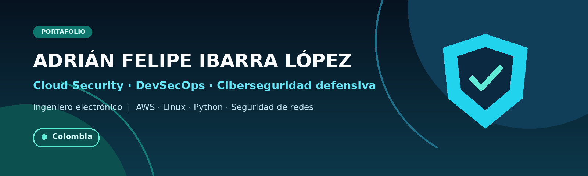

  

## Sobre mí

Ingeniero electrónico y estudiante de especialización en Tecnologías de la
Información y las Comunicaciones, orientado a **Cloud Security, DevSecOps y
ciberseguridad defensiva**.

Construyo laboratorios y soluciones que combinan infraestructura cloud,
automatización, redes y desarrollo backend. Actualmente busco oportunidades
junior en **Cloud, Cloud Security o DevSecOps**, con proyección hacia
arquitectura cloud segura.

## Enfoque técnico

- **Cloud y seguridad:** AWS, IAM, VPC, monitoreo, hardening y seguridad de redes.
- **DevSecOps y automatización:** Linux, Docker, GitHub Actions, CI/CD y Git.
- **Desarrollo backend:** Python, FastAPI, APIs REST, PostgreSQL y SQLite.

## Proyectos publicados

### [AWS E-commerce Lab](https://github.com/felipelbarra98/aws-ecommerce-lab)

Caso técnico de arquitectura web segura en AWS con VPC, EC2, S3, controles IAM,
cifrado, monitoreo y análisis de mejoras para alta disponibilidad.

`AWS` `Cloud Security` `VPC` `EC2` `S3` `IAM`

### [ViviSmart Cybersecurity Lab](https://github.com/felipelbarra98/vivismart-cybersecurity-lab)

Laboratorio autorizado de ciberseguridad para un entorno IoT, enfocado en
segmentación de red, reglas de firewall y validaciones defensivas.

`pfSense` `Nmap` `Metasploit` `VirtualBox` `Network Security`

<strong>Otros productos y soluciones desarrollados</strong>

 

| Proyecto | Alcance | Publicación prevista |
| --- | --- | --- |
| **NovaHotel PMS** | PMS multiempresa y multihotel con reservas, check-in, habitaciones, caja, roles y operación hotelera. | Caso técnico y repositorio después de la auditoría de seguridad. |
| **NovaPOS** | Sistema de ventas, inventario, compras, clientes, créditos, caja, usuarios y reportes. | Caso técnico público sin información comercial ni datos de clientes. |
| **Sistema de gestión funeraria** | Gestión de afiliados, contratos, servicios, pagos, caja, recordatorios y documentos. | Caso técnico sanitizado; el código y las plantillas del cliente permanecerán privados. |
| **Control360** | Plataforma personal para finanzas, tareas, recordatorios, hábitos y proyectos. | Repositorio público después de revisar configuración y credenciales. |
| **NovaTIC Solutions** | Sitio corporativo y portafolio de servicios tecnológicos. | Código y enlace de despliegue cuando se consolide la versión pública. |

> Los productos comerciales o desarrollados para clientes se presentarán mediante
> casos técnicos sanitizados. No se publicarán bases de datos, credenciales,
> documentos privados ni código sujeto a restricciones comerciales.

## Formación complementaria

[Ver perfil e insignias verificables en Credly](https://www.credly.com/users/adrian-felipe-ibarra-lopez)

- AWS Academy Cloud Foundations.
- AWS Academy Cloud Security Foundations.
- AWS Academy Cloud Security Builder.
- AWS Academy Cloud Web Application Builder.
- Cisco CyberOps Associate.

## Actualmente fortaleciendo

`AWS` · `Linux` · `Docker` · `DevSecOps` · `Infraestructura como código`

## Contacto

- [GitHub](https://github.com/felipeIbarra98)
- [LinkedIn](https://www.linkedin.com/in/adrian-felipe-ibarra-lopez)
- [Insignias verificadas en Credly](https://www.credly.com/users/adrian-felipe-ibarra-lopez)
